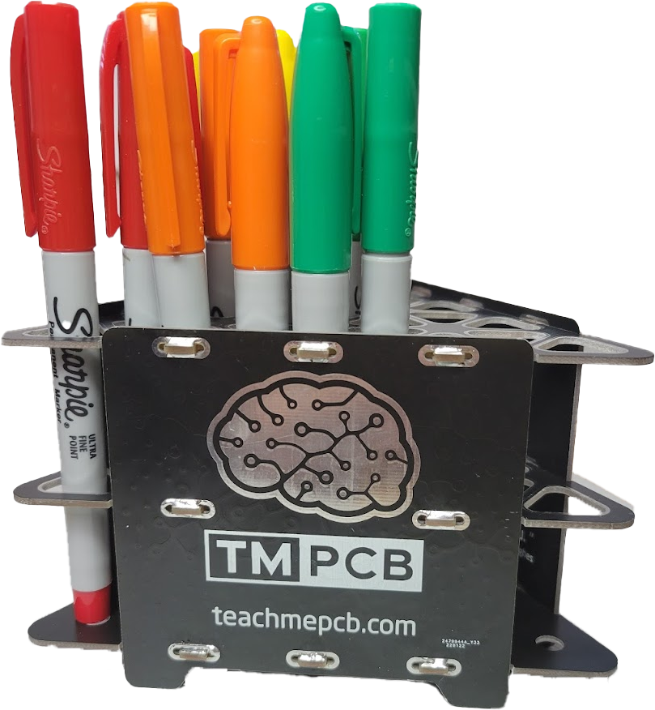

# Pencil Holder
The TeachMEPCB Promotional Pencil Holder is (to our knowledge) the first flat-pack PCB design.  And it's your idea to steal and make your own!

Use with our compliments.  Please credit Elliot Wakefield (who did 90% of the work), Paul Daily (10% of the work), and Mark Hughes (0% of the work, but who came up with the idea!)
